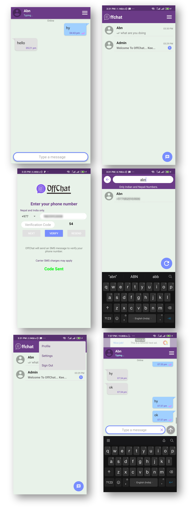

# OffChat

A simple android chatting app.

App Link - [Download App](https://github.com/abdheshnayak/OffChat/blob/master/app/release/app-release.apk)

#### ScreenShots

## Built With

* [JAVA](https://docs.oracle.com/javase/8/docs/api/) - A high-level programming language developed by Sun Microsystems.
* [Android](https://developer.android.com/docs) - Android is a mobile operating system based on a modified version of the Linux kernel and other open source software, designed primarily for touchscreen mobile devices such as smartphones and tablets.

## Why OffChat

This app is developed for online-offline chatting. but it is under construction. At present, you can use this app like an online instant messaging app.
This app does not store your chat so you can use it without any fear.
Your messages will be deleted instantly after its delivery.

## LICENSE

This project is licensed under the Apache License 2.0 - see the [LICENSE](LICENSE) file for details

## Authors

* **Abdhesh Nayak** - [Github](https://github.com/abdheshnayak), [LinkedIn](https://www.linkedin.com/in/abdhesh-nayak/)

See also the list of [contributors](https://github.com/abdheshnayak/OffChat/contributors) who participated in this project.
