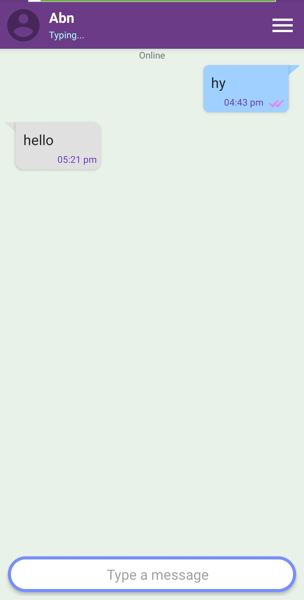
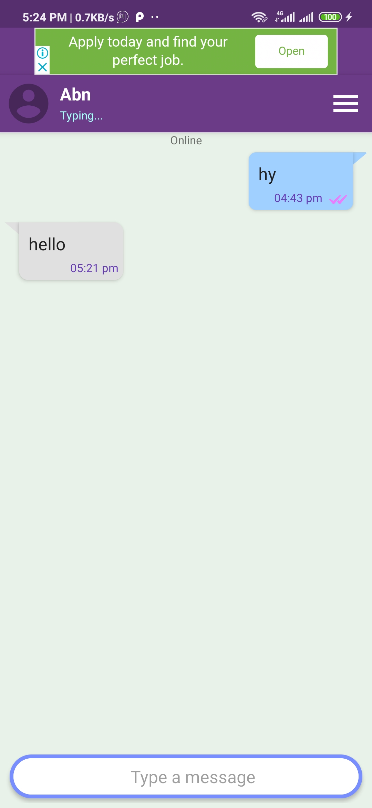
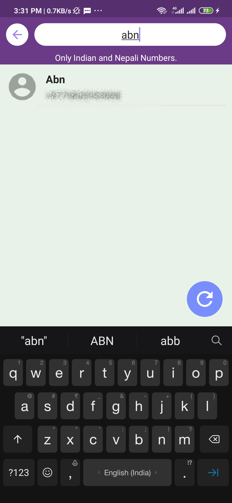
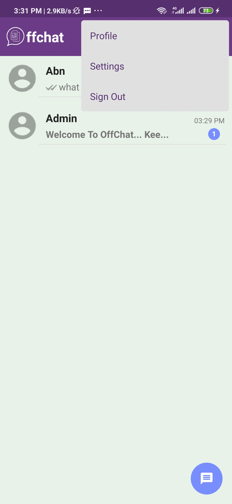

# OffChat

Android app Project For Chatting.

## Built With

* [JAVA](https://docs.oracle.com/javase/8/docs/api/) - A high-level programming language developed by Sun Microsystems.
* [Android](https://developer.android.com/docs) - Android is a mobile operating system based on a modified version of the Linux kernel and other open source software, designed primarily for touchscreen mobile devices such as smartphones and tablets.

## Authors

* **Abdhesh Nayak** - [Github](https://github.com/abdheshnayak), [LinkedIn](https://www.linkedin.com/in/abdhesh-nayak/)

See also the list of [contributors](https://github.com/abdheshnayak/OffChat/contributors) who participated in this project.
