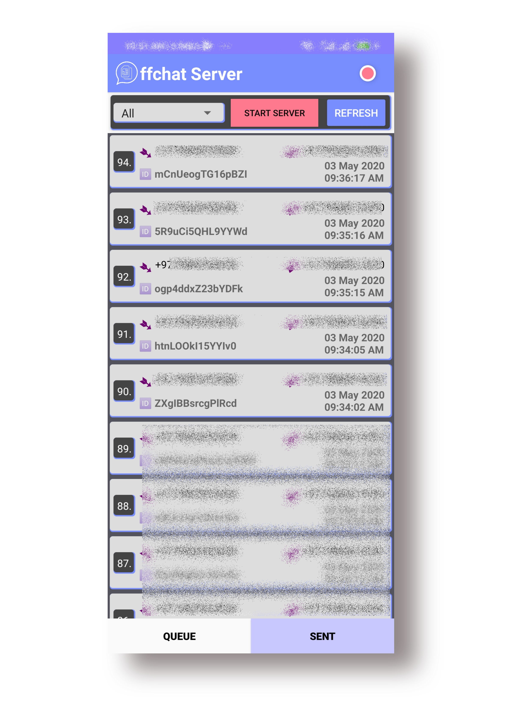

# OffChat Server

Server app of Project [OffChat](https://abdheshnayak.github.io/OffChat/).

#### ScreenShots

## Built With

* [JAVA](https://docs.oracle.com/javase/8/docs/api/) - A high-level programming language developed by Sun Microsystems.
* [Android](https://developer.android.com/docs) - Android is a mobile operating system based on a modified version of the Linux kernel and other open source software, designed primarily for touchscreen mobile devices such as smartphones and tablets.

## Why OffChat Server

This server will be used for the processing undelivered messages sent by the [OffChat](https://github.com/abdheshnayak/OffChat) app and then it will deliver to its destination according to type, through online or through SMS.

## LICENSE

This project is licensed under the Apache License 2.0 - see the [LICENSE](https://abdheshnayak.github.io/OffChat/LICENSE) file for details

## Authors

* **Abdhesh Nayak**

	 

See also the list of [Contributors](https://github.com/abdheshnayak/OffChat/contributors) who participated in this project.
